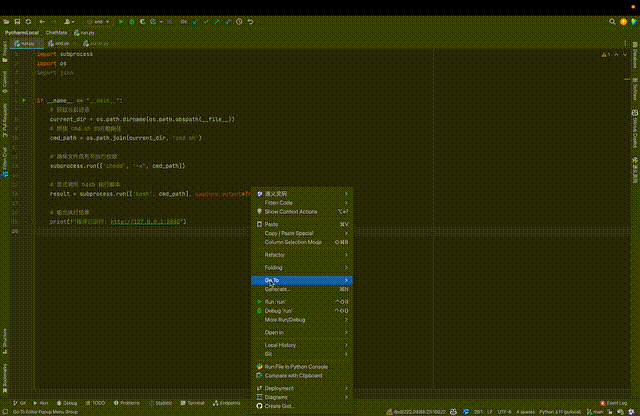
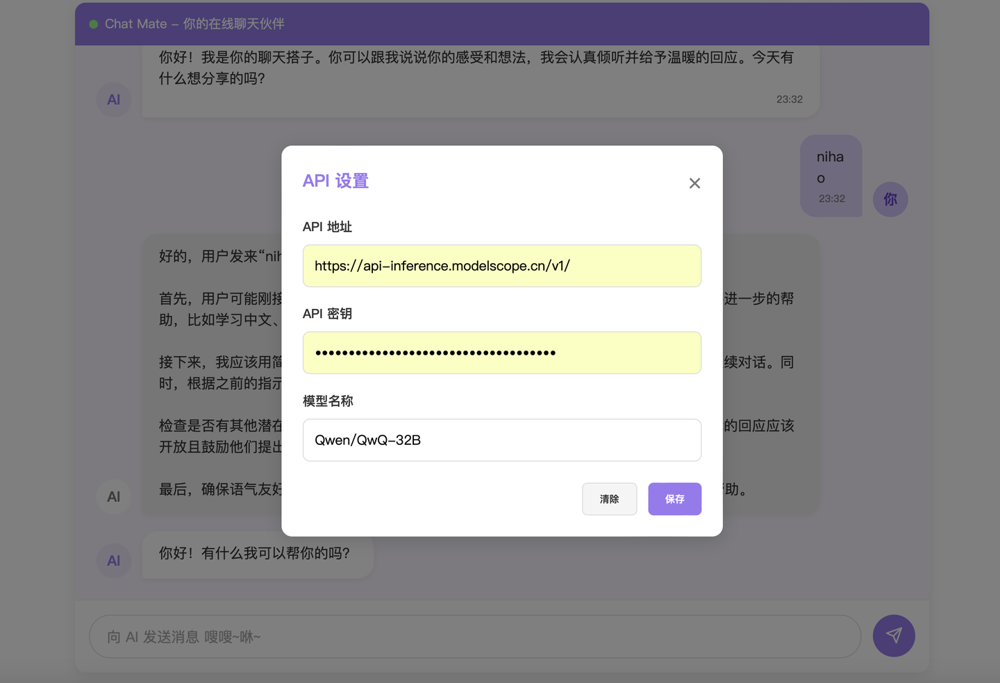
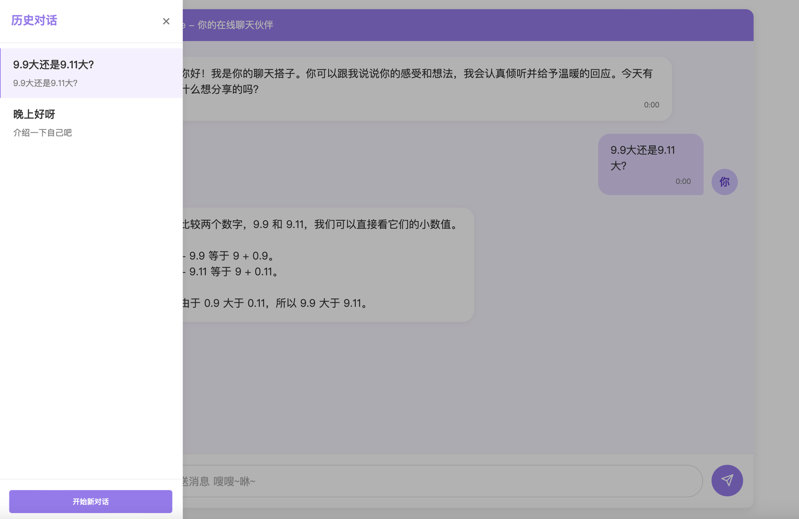
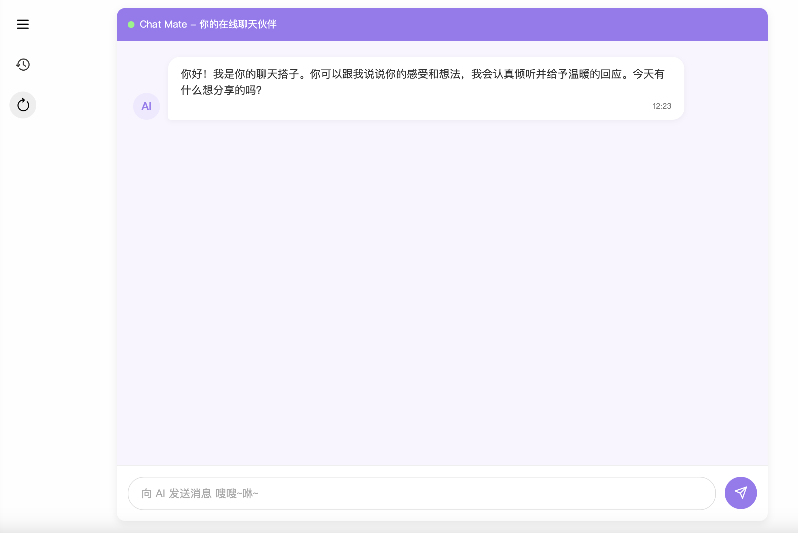

## ChatMate: A Simple Online Chat Partner for Everyone



### 主要特征
- **低代码量**：前后端总计代码量仅为 1000 行左右，便于快速学习和修改。
- **低抽象性**：采用前后端分离的构建方式。前端使用原生的 HTML、CSS 和 JavaScript 实现，没有使用任何框架或库，后端主要使用 Flask 编写。
- **功能完整**：实现了一个大模型在线聊天应用的基本特征功能，包括流式输出、会话切换、模型思考等。
- **高兼容性**：可兼容任何可通过 API 调用的 LLM，或本地通过 Ollama 部署的 LLM。
- **极简设计**：小而美的 UI 界面简单美观，轻松使用和学习。

### 运行环境
#### 下载项目
```shell
git clone https://github.com/Lafitte1573/ChatMate.git
```
#### 安装依赖
```shell
// 新建虚拟环境
conda create -n chatmate python=3.10

// 激活虚拟环境
conda activate chatmate

// 安装依赖
pip install flask flask_cors

// 安装 Ollama (optional)
pip install ollama

// 进入项目目录
cd ChatMate
```

#### 启动与终止
```shell
// 启动服务
python run.py

// 终止服务
python end.py
```

成功运行后可在终端看到提示信息`程序已运行: http://127.0.0.1:8080`，表示前端服务已启动成功。

> 注意：
> 1. 默认将前端运行在 `localhost:8080`，后端运行在 `localhost:8000`，可以在 `web_server.py` 和 `openai_server.py` 中分别修改前、后端的运行端口。
> 2. 终止运行项目一定要执行 `python end.py` 释放端口占用。
> 3. 如果修改后端的运行端口，需要在 `static/scripts.js` 文件的第 3 行同步修改 `SERVER_PORT` 变量的值。

### 使用方式
1. **API 设置**：点击页面侧边栏第一个按钮，输入 API 地址、 API 密钥和模型名称，点击保存按钮即可完成设置。
2. **开始对话**：和 Deepseek 怎么聊天的就和 ChatMate 聊天，输入消息，点击发送按钮或回车即可。

### 运行示例 & 功能说明
1. **API 设置**：点击页面侧边栏第一个按钮，输入 API 密钥和模型名称，点击保存按钮即可完成设置。默认使用 OpenAI API 调用模型，如果运行本地模型，请在 `API 地址` 栏输入 `Ollama`，并忽略 `API 密钥`。
    
2. **会话切换**：点击页面侧边栏第二个按钮，可切换当前会话或开启新的会话。
   
3. **清空对话上下文**：点击页面侧边栏第三个按钮，可清空当前会话中的对话历史。
   
4. **流式输出**：LLM 的响应文本分为两种形式，灰色气泡中为思考过程（仅推理大模型，如 QwQ-32B、Deepseek-R1）、白色气泡中为最终响应，两种文本均采用流式输出。

### 主要用途
1. **本地模型的 UI 界面**：采用 Ollama、vllm 等方式本地部署的模型本身不具备 UI 界面和窗口，ChatMate 可以作为本地模型的 UI 界面使用。
2. **学习与开发**：现有的大模型聊天界面，如 OpenWebUI、ChatBox 等，功能复杂、抽象性高、使用繁琐（需要注册和登录等），支持的模型也有限。ChatMate 的使用和改进都非常简单，更加适合作为大模型初学者和开发者的入门项目。

### 功能拓展
开发者可在本项目基础上进一步拓展出以下功能：
1. **Markdown 支持**：当前的 ChatMate 不支持 Markdown 文本的格式输出，开发者可修改 `static/scripts.js` 并添加聊天气泡中对 Markdown 的编译支持。
2. **模型输出终止**：当前的 ChatMate 不支持模型输出终止，开发者可在 `static/scripts.js` 中为 `消息发送按钮` 添加事件以实现对模型输出的终止支持。
