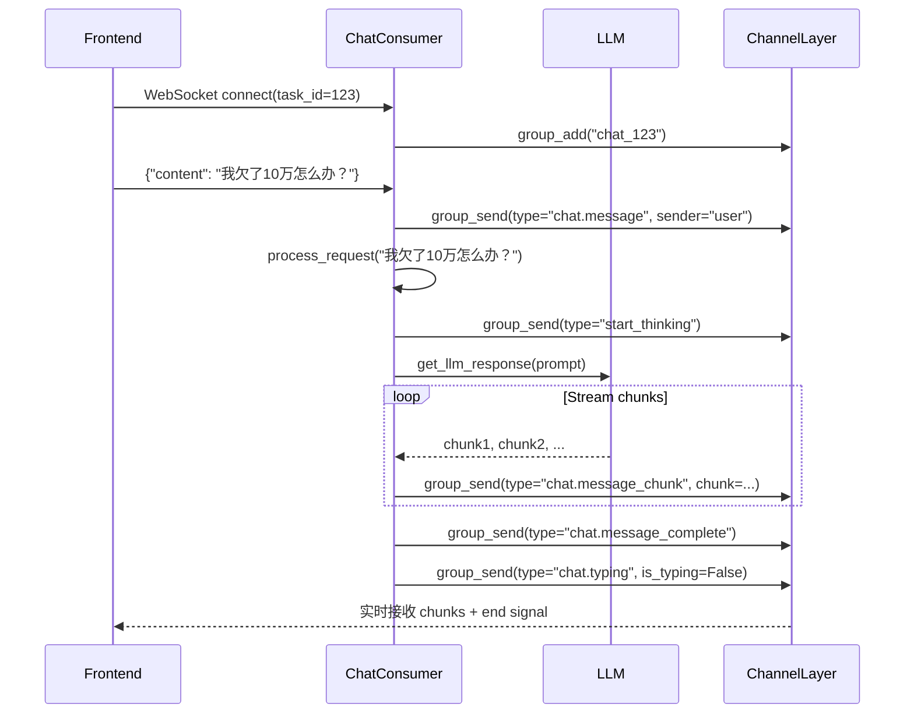

## 步骤 1：使用 Django REST 框架处理请求

旅程始于前端，用户向我们的 Django 后端发送 POST 请求。此时，Django REST 框架 (DRF) 开始发挥作用，负责处理请求验证和初始处理。DRF 确保传入的数据干净且符合预期结构，从而使后端能够专注于高效地编排 AI 工作流。

## 第 2 步：使用 Celery 卸载繁重任务

请求验证通过后，Django 会触发 Celery 任务。Celery 是我们异步处理的骨干。通过将资源密集型任务（例如与大型语言模型 (LLM) 交互）卸载到 Celery Worker，我们确保主请求-响应周期保持快速响应。

这种设计将人工智能逻辑与用户交互分离，使我们的系统能够处理复杂的操作而不会给用户造成延迟。

我们流程的第一步是从前端向 Django REST API 视图发送**POST 请求**。该视图负责接收用户的消息或提示，并在将其交给 AI 代理之前进行处理。

Django REST Framework (DRF) 使这一步骤变得简单而强大，可以处理以下基本功能：

- **数据序列化：**使用序列化器验证和准备传入的数据。
- **限制：**为了防止滥用，强制执行请求限制。
- **身份验证：**确保只有授权用户才能与端点交互。

## 步骤 3：使用 Redis 管理任务队列

Redis 是 Django 和 Celery 工作器之间的代理。它充当通信层，可靠地对任务进行排队，并使系统能够根据需要进行扩展。无论是处理单个请求还是数千个请求，Redis 都能确保任务不会丢失，并且所有请求都能有序地处理。

## 步骤 4：与大型语言模型进行通信

Celery 工作器从 Redis 队列中获取任务，并开始执行繁重的工作——与大型语言模型 (LLM) 的 API 进行通信。这种模块化方法支持与 OpenAI 和 Anthropic 等闭源提供商以及 Llama 或 Mixtral 等开源选项的无缝集成。通过将 LLM 交互保留在 Celery 工作器中，我们保持了灵活性，使我们能够轻松集成多个 AI 提供商或在它们之间切换。AI 代理的结构非常灵活，可以采用多种方法，其理念是提示、增强、调用函数并持久化数据，直到获得所需结果。这里有许多库和框架可供使用，例如**LlamaIndex**或**LangChain**，对于更简单的实现，您也可以自己实现提示。需要强调的一件重要事情是，代理在芹菜工作者中完全异步执行，因此我们系统的请求周期完全畅通无阻，并且芹菜工作者完全可以水平扩展。在代理步骤中，可以保留数据以等待下一个 LLM 响应。

## 步骤 5：使用 Django Channels 进行实时更新

一旦 Celery 工作器完成 AI 处理，结果就会被发送回 Django。为了提供流畅且互动的用户体验，我们使用 Django Channels 将响应实时发送回前端。这消除了页面刷新的需要，并为用户提供了即时反馈，使应用程序感觉更现代、响应更快。

# AI代理模块说明文档

## 1. 系统架构

AI代理模块采用现代化的异步处理架构，包含以下核心组件：

- **前端**: 通过WebSocket与后端实时通信
- **后端**: Django REST API处理HTTP请求
- **任务队列**: Celery处理异步AI任务
- **消息代理**: Redis用于Celery和WebSocket通信
- **AI服务**: OpenAI API提供AI能力

## 2. 核心组件

### AgentTask模型 (ai_agent/models.py)
存储AI任务信息：
- 任务类型：债务分析、还款计划、财务建议
- 状态管理：待处理、处理中、已完成、失败
- 输入数据和结果存储
- 进度跟踪和错误信息记录

### 视图函数 (ai_agent/views.py)
- `create_agent_task`: 创建新任务的API端点
- `agent_task_list`: 获取用户所有任务
- `agent_task_detail`: 获取特定任务详情
- `agent_task_status`: 获取任务状态
- `websocket_test`: WebSocket测试页面

### 序列化器 (ai_agent/serializers.py)
- `AgentTaskCreateSerializer`: 任务创建序列化
- `AgentTaskSerializer`: 任务详情序列化

### Celery任务 (ai_agent/tasks.py)
- `process_agent_task`: 主要的任务处理函数
- 调用LLM客户端处理不同类型的任务
- 实时更新任务状态并通过WebSocket推送

### LLM客户端 (ai_agent/llm_client.py)
- `get_debt_analysis`: 债务分析
- `get_repayment_plan`: 还款计划生成
- `get_financial_advice`: 财务建议

## 3. 完整工作流程

### 3.1 任务创建
1. 用户通过WebSocket测试页面或API发送任务请求
2. 请求包含任务类型和输入数据
3. 系统创建AgentTask对象并保存到数据库

### 3.2 异步处理
1. 创建任务后立即触发Celery异步任务
2. Celery worker接收任务并开始处理
3. 根据任务类型调用相应的AI服务

### 3.3 AI处理
1. 调用OpenAI API处理用户请求
2. 根据任务类型构造不同的提示词
3. 获取AI生成的结果

### 3.4 状态更新
1. 处理过程中实时更新任务状态
2. 通过WebSocket将状态推送到前端
3. 任务完成后保存结果到数据库

### 3.5 结果返回
1. 用户可以通过API查询任务状态
2. WebSocket实时推送任务进度和结果
3. 前端显示最终的AI分析结果

## 4. 修复的问题

### 4.1 函数调用错误
- **问题**: tasks.py中调用了未定义的函数
- **修复**: 替换为llm_client.py中的正确函数

### 4.2 Celery配置
- 确保Celery worker正确启动并发现任务
- 验证Redis连接正常

### 4.3 认证问题
- 临时移除了API端点的认证要求以便测试

## 5. 当前状态

系统架构完整，各组件正常工作：
- 任务可以成功创建和处理
- WebSocket实时通信正常
- 唯一的问题是OpenAI API调用超时，这与网络或API密钥配置有关

## 6. 使用说明

### 6.1 启动服务
1. 启动Redis服务器
2. 启动Celery worker: `python -m celery -A DebtOptimizer worker --loglevel=info`
3. 启动Django服务器: `python manage.py runserver`

### 6.2 测试AI代理
1. 访问测试页面: http://127.0.0.1:8000/ai_agent/websocket-test/
2. 通过页面或API创建任务
3. 查看实时处理结果

### 6.3 API端点
- 创建任务: POST /ai_agent/api/tasks/create/
- 任务列表: GET /ai_agent/api/tasks/
- 任务详情: GET /ai_agent/api/tasks/{task_id}/
- 任务状态: GET /ai_agent/api/tasks/{task_id}/status/

## 7. 注意事项

1. 确保.env文件中配置了正确的OpenAI API密钥
2. 确保Redis服务器正常运行
3. 网络连接稳定以避免API调用超时